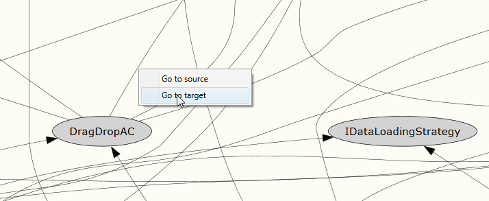
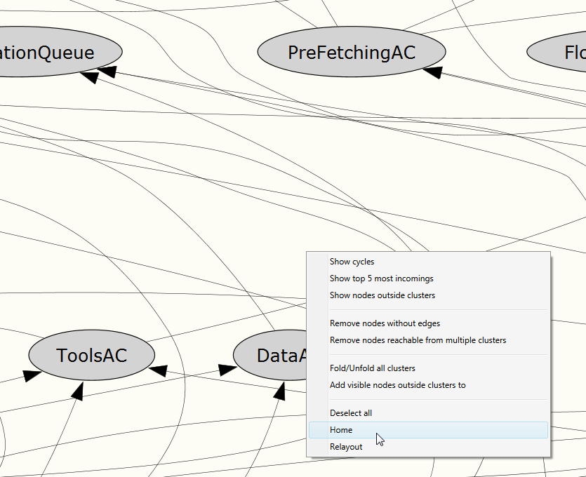
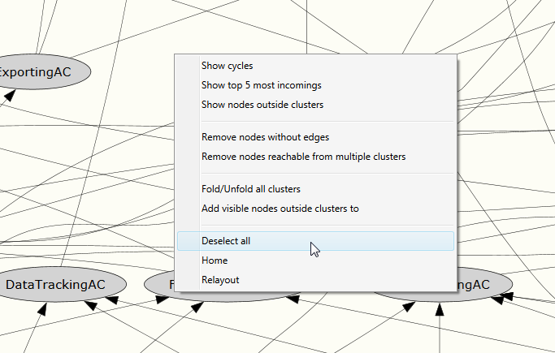
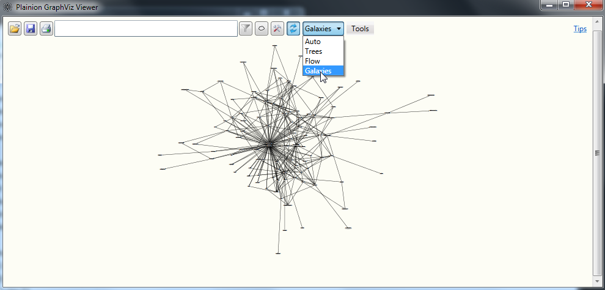

# Basics

Each graph consists of nodes and edges. Optionally nodes an be grouped into (clusters)[Clusters]. 

The interaction with the graph is mostly mouse driven.

- Use LMB-Drag to pan the graph
- Use the mouse wheel to zoom in and out at the point in the graph where the mouse pointer is pointing to
- Use RMB-Drag to draw a rectangle you want to zoom in

Use RMB-Click on an edge to jump to source or target node of that edge.

Use the RMB-Click on the canvas and the "Home" context menu to reset the zoom to the initial value.

## Search

You can use the search box find nodes in a complex graph. It has a preview popup to support the search.
You have to select the node you are interested in with ENTER to trigger the search.

*Note:* unfortionately the search is sometimes not exactly locating the found node in the center of the canvas,
so you may have to slowly zoom out and check a bit left and right. This will be improved in future version.

## Selection

You can you Ctrl-LMB-Click to select one or multple nodes and edges. This may help to keep the overview in a 
huge graph while manually navigating with zoom and pan.

Use RMB-Click on the canvas and the "Deselect all" context menu to remove all selection from the graph.

## Graph Layouts

Plainion.Graphviz supports various graph layout algorithms.

### Tree

Most of the time you probably want to layout your graph in a kind of tree or hierachical structure because this 
gives usually the best overview about node dependencies. 

*Note:* If the graph is too complex (too many edges) this layout algorithm may fail. You may even see a 
"Windows Error Reporint (WER)" dialog popping up. You can click it away - a fallback algorithm will be selected
automatically.

### Flow

This algorithm is very similar to the "Tree" algorithm except that arrows are flowing from left to right.

*Note:* same limitation as with "Tree" algorithm

### Galaxies

This algorithm organizes dependencies in a circular way. It is fast and can handle even extremely huge graphs.

This algorithm does not support clusters very well.
