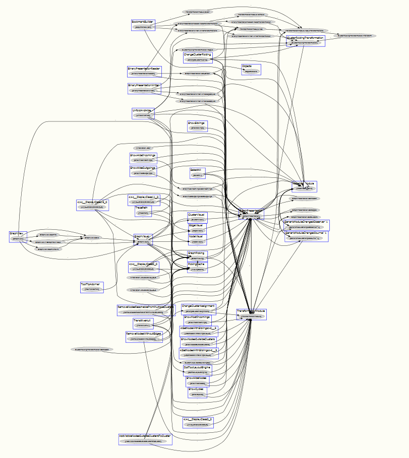

# Discover a call tree (.NET only)

Discovering API usage is comparable simple with modern IDEs like Visual Studio and tools like Reflector. 
But if you want span a full call tree from an API to its users and from there to their users and so on things
become more complex. The CallTree tool makes this task easier.


To start spanning a call tre load a configuration file of the following schema:

```json
{
    "binFolder": "D:/Workspace/Plainion/Plainion.GraphViz/bin/Debug",
    "sources": [ "Plainion.GraphViz.dll" ],
    "targets": [
        {
            "assembly": "Plainion.Core.dll",
            "type": "Plainion.Objects",
            "method": "Clone"
        }
    ],
    "relevantAssemblies": [ "Plainion.*" ]
}
```

- "binFolder" specifies the folder where all assemblies are located
- "sources" specifies the source assemblies. Wildcards supported.
- "targets" specifies the target API by assembly, type and method. "Method" can also be the getter/setter method
  of a property or add/remove method of an event. 
- "relevantAssemblies" can be used to limit the assemblies to be analyzed.

When clicking "Create graph" you will get a graph showing all possible call paths from the source assemblies to the
target API.


